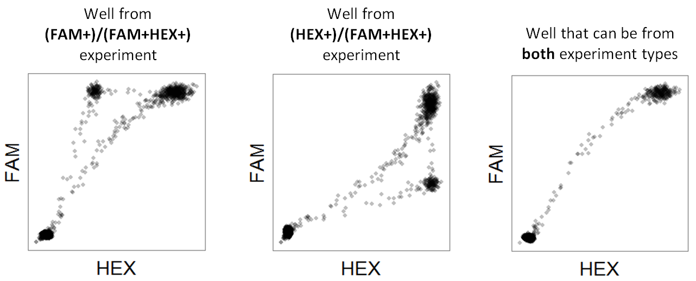

# ddpcr: Analysis and visualization of Digital Droplet PCR data in R and on the web

This package provides an interface to explore, analyze, and visualize droplet digital PCR (ddPCR) data in R. An interactive tool was also created and is available online to facilitate this analysis for anyone who is not comfortable with using R.

## Background

Droplet Digital PCR (ddPCR) is a technology provided by Bio-Rad for performing digital PCR. The basic workflow of ddPCR involves three main steps: partitioning sample DNA into 20,000 droplets, PCR amplifying the nucleic acid in each droplet, and finally passing the droplets through a reader that detects flurescent intensities in two different wavelengths corresponding to FAM and HEX dyes. As a result, the data obtained from a ddPCR experiment can be visualized as a 2D scatterplot (one dimension is FAM intensity and the other dimension is HEX intensity) with 20,000 points (each droplet represents a point).

ddPCR experiments can be defined as singleplex, duplex, or multiplex depending on the number of dyes used (one, two, and more than two, respectively). A duplex experiment typically uses one FAM dye and one HEX dye, and consequently the droplets will be grouped into one of four clusters: double-negative (not emitting fluorescence from either dye), HEX-positive, FAM-positive, or double-positive. When plotting the droplets, each quadrant of the plot corresponds to a cluster; for example, the droplets in the lower-left quadrant are the double-negative droplets.

After running a ddPCR experiment, a key step in the analysis is gating the droplets to determine how many droplets belong to each cluster. Bio-Rad provides an analysis software called QuantaSoft which can be used to perform gating. QuantaSoft can either do the gating automatically or allow the user to set the gates manually. Most ddPCR users currently gate their data manually because QuantaSoft's automatic gating often does a poor job and **there are no other tools available for gating ddPCR data**.

## Overview

The `ddpcr` package allows you to upload ddPCR data, perform some basic analysis, explore characteristic of the data, and create customizable figures of the data.  

### Main features

The main features include:

- **Identify failed wells** - determining which wells in the plate seemed to have failed the ddPCR experiment, and thus these wells will be excluded from all downstream analysis. No template control (NTC) will be deemed as failures by this tool.
- **Identify outlier droplets** - sometimes a few droplets can have an extremely high fluorescent intensity value that is probably erroneous, perhaps as a result of an error with the fluorescent reader. These droplets are identified and removed from the downstream analysis.
- **Identify empty droplets** - droplets with very low fluorescent emissions are considered empty and are removed from the downstream analysis. Removing these droplets is beneficial for two reasons: 1. the size of the data is greatly reduced, which means the computations will be faster on the remaining droplets, and 2. the real signal of interest is in the non-empty droplets, and empty droplets can be regarded as noise.
- **Calculating template concentration** - after knowing how many empty droplets are in each well, the template concentration in each well can be calculated.
- **Gating droplets** - if your experiment matches some criteria (more on that soon), then automatic gating can take place; otherwise, you can gate the data manually just like on QuantaSoft.
- **Explore results** - the results from each well (# of drops, # of outliers, # of empty drops, concentration) can be explored as a histogram or boxplot to see the distribution of all wells in the plate.
- **Plot** - you can plot the data in the plate with many customizable features.

### Supported experiment types

While this tool was originally developed to automatically gate data for a particular ddPCR assay (the paper for that experiment is in progress), any assay with similar characteristics can also use this tool to automatically gate the droplets. In order to benefit from the full automatic analysis, your ddPCR experiment needs to have these characteristics:  

- The experiment is a duplex ddPCR experiment
- The majority of droplets are empty (double-negative)
- The majority of non-empty droplets are double-positive
- There can be a third cluster of either FAM+ or HEX+ droplets

In other words, the built-in automatic gating will work when there are three clusters of droplets: (1) double-negative, (2) double-positive, and (3) either FAM+ or HEX+. These types of experiments will be referred to as **(FAM+)/(FAM+HEX+)** or  **(HEX+)/(FAM+HEX+)**. Both of these experiment types fall under the name of **PNPP experiments**; PNPP is short for PositiveNegative/PositivePositive, which is a reflection of the droplet clusters. Here is what a typical well from a PNPP experiment looks like:

[](vignettes/figures/supported-exp-types.png)

If your experiment matches the criteria for a **PNPP** experiment (either a **(FAM+)/(FAM+HEX+)** or a **(HEX+)/(FAM+HEX+)** experiment), then after calculating empty droplets the program will analyze the rest of the droplets and assign each droplet one of the following three clustes: FAM+ (or HEX+), FAM+HEX+, or rain. Here is the result of analyzing a single well from a **(FAM+)/(FAM+HEX+)** experiment:

[](vignettes/figures/ppnp-simple-result.png)

If your ddPCR experiment is not a **PNPPP** type, you can still use this tool for the rest of the analysis, exploration, and plotting, but it will not benefit from the automatic gating. However, `ddpcr` is built to be easily extensible, which means that you can add your own experiment "type". Custom experiment types need to define their own method for gating the droplets in a well, and then they can be used in the same way as the built-in experiment types.

## Using the interactive tool

If you're not comfortable using R and would like to use a visual tool that requires no programming, you can [use the tool online](TODO). If you do know how to run R, using the interactive tool (built with [shiny](http://shiny.rstudio.com/))

## Quick start

```
library(ddpcr)
dir <- "../../data/mini141"
plate <- new_plate(dir)
```
